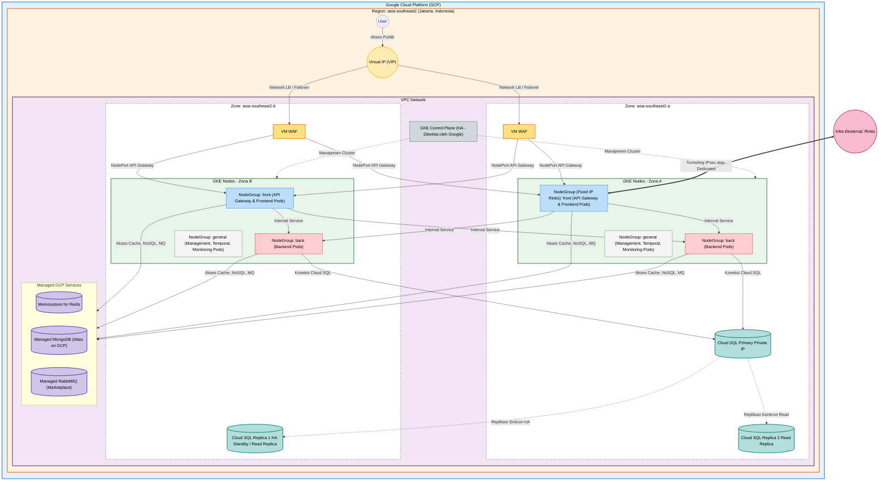

# Arsitektur Topologi GCP High Availability

Dokumen ini menjelaskan desain infrastruktur Google Cloud Platform (GCP) yang mencakup 2 Zona, HAProxy (VM WAF), dan GKE Cluster dengan pemisahan Node Groups.

## Diagram Arsitektur

## Ringkasan Komponen

| Komponen | Deskripsi |
| --- | --- |
| **VIP** | Virtual IP yang berfungsi sebagai entry point traffic publik. |
| **VM WAF** | Instance VM yang menjalankan HAProxy dan Web Application Firewall. |
| **GKE front** | Node Group khusus untuk API Gateway dan Frontend Pods. |
| **GKE back** | Node Group khusus untuk Backend Pods dengan akses ke Database. |
| **GKE general** | Node Group untuk layanan manajemen, monitoring, dan workflow. |
| **Cloud SQL** | Database relasional terkelola dengan konfigurasi High Availability. |
| **Managed GCP** | Layanan PaaS seperti Memorystore (Redis) dan MongoDB Atlas. |
| **Rintis** | Infrastruktur eksternal yang terhubung melalui tunnel IPsec/Dedicated. |