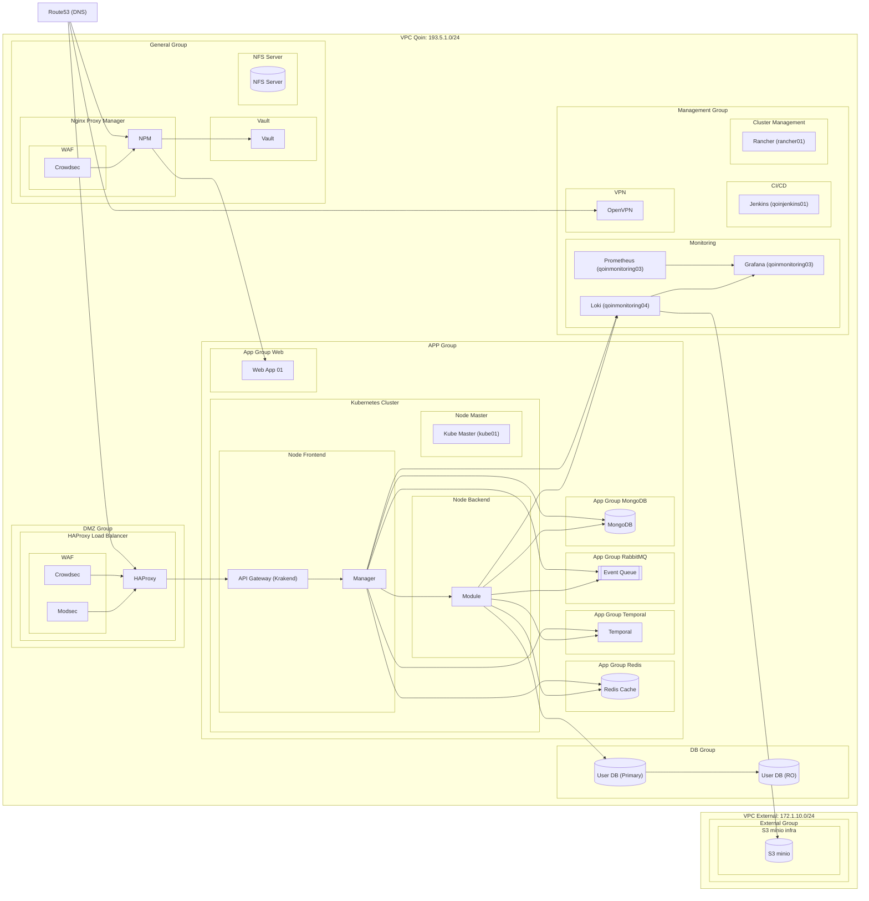

# Diagram Topologi Qoin

Diagram ini merupakan konversi arsitektur dari file `topology.py` ke format Markdown Mermaid.js.

```mermaid
flowchart LR
    DNS["Route53 (DNS)"]

    subgraph VPC_Ext ["VPC External: 172.1.10.0/24"]
        subgraph Ext_Grp ["External Group"]
            subgraph S3_Minio ["S3 minio infra"]
                minio02[("S3 minio")]
            end
        end
    end

    subgraph VPC_Qoin ["VPC Qoin: 193.5.1.0/24"]
        subgraph DMZ ["DMZ Group"]
            subgraph HALB ["HAProxy Load Balancer"]
                lb["HAProxy"]
                subgraph WAF_DMZ ["WAF"]
                    crowdsec_dmz["Crowdsec"]
                    modsec_dmz["Modsec"]
                end
            end
        end

        subgraph APP ["APP Group"]
            subgraph K8S ["Kubernetes Cluster"]
                subgraph Node_Front ["Node Frontend"]
                    svc_apigw["API Gateway (Krakend)"]
                    svc_manager["Manager"]
                end
                subgraph Node_Back ["Node Backend"]
                    svc_module["Module"]
                end
                subgraph Node_Master ["Node Master"]
                    kube_master["Kube Master (kube01)"]
                end
            end

            subgraph App_Web ["App Group Web"]
                web01["Web App 01"]
            end

            subgraph App_Redis ["App Group Redis"]
                cache[("Redis Cache")]
            end

            subgraph App_Temporal ["App Group Temporal"]
                temporal["Temporal"]
            end

            subgraph App_RabbitMQ ["App Group RabbitMQ"]
                queue[["Event Queue"]]
            end

            subgraph App_MongoDB ["App Group MongoDB"]
                mongodb[("MongoDB")]
            end
        end

        subgraph DB ["DB Group"]
            db_primary[("User DB (Primary)")]
            db_replicas[("User DB (RO)")]
        end

        subgraph Management ["Management Group"]
            subgraph Monitoring ["Monitoring"]
                grafana["Grafana (qoinmonitoring03)"]
                prometheus["Prometheus (qoinmonitoring03)"]
                loki["Loki (qoinmonitoring04)"]
            end
            subgraph CICD ["CI/CD"]
                jenkins["Jenkins (qoinjenkins01)"]
            end
            subgraph Cluster_Mgmt ["Cluster Management"]
                rancher["Rancher (rancher01)"]
            end
            subgraph VPN_Grp ["VPN"]
                vpn["OpenVPN"]
            end
        end

        subgraph General ["General Group"]
            subgraph NPM_Grp ["Nginx Proxy Manager"]
                npm["NPM"]
                subgraph WAF_Gen ["WAF"]
                    crowdsec_general["Crowdsec"]
                end
            end
            subgraph Vault_Grp ["Vault"]
                vault["Vault"]
            end
            subgraph NFS_Grp ["NFS Server"]
                nfs[("NFS Server")]
            end
        end
    end

    %% Connections
    DNS --> lb
    DNS --> npm
    DNS --> vpn

    lb --> svc_apigw
    crowdsec_dmz --> lb
    modsec_dmz --> lb

    svc_apigw --> svc_manager
    svc_manager --> svc_module

    svc_manager --> cache
    svc_module --> cache

    svc_manager --> queue
    svc_module --> queue

    svc_module --> db_primary
    db_primary --> db_replicas

    npm --> web01
    npm --> vault
    crowdsec_general --> npm

    svc_manager --> mongodb
    svc_module --> mongodb

    svc_manager --> temporal
    svc_module --> temporal

    svc_manager --> loki
    svc_module --> loki

    prometheus --> grafana
    loki --> grafana
    loki --> minio02
```
